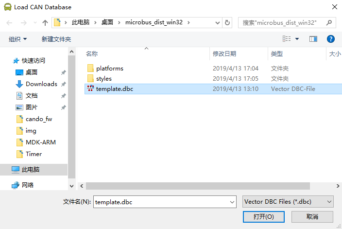

# 一 cando: USB-CAN 转换模块


***cando*** 是一个低成本的USB-CAN转换模块，可以在Windos、Linux系统运行，在Windos系统无需安装驱动，在Linux系统为socketcan接口，可以使用标准的can-utils命令对 ***cando*** 操作。采用USB buck 传输，所以性能要高于串口或者虚拟串口。

- 支持 CAN2.0A/B 最大波特率 1M
- 自恢复保险丝，防止损坏USB口
- 采用内部晶振，配合USB通讯校准同步
- 配套的调试软件 ***microbus***
- Micro-USB 接口
- MKDSN 5.08 螺旋接线端子 CANH, CANL
- 2.54跳线帽 BOOT 选择
- 2.54跳线帽 CAN 终端电阻选择
- 支持二次开发，并提供 Python 库
- 尺寸 4 x 1.6 cm

# 二 microbus: CAN总线调试软件


***microbus*** 是 ***cando*** 专用的、简单易用的can总线调试软件，支持接收发送can标准帧、数据帧等。
- 支持 Windos/Linux
- 最大支持同时接入32个 ***cando*** 模块
- 数据帧时间戳
- 支持数据日志保存
- 支持 CAN DBC 文件格式解析
- 软件免安装 

# 三 使用说明

## 1. 设置跳线帽

***cando*** 有两个跳线帽分别为 ”BOOT“ 和 ”TERM“

- 如果 ”BOOT“ 跳线帽设置在靠近 BOOT 丝印一侧，***cando*** 上电后将进入 USB DFU 模式，如果设置在另一侧上电正常工作。
- 如果 ”TERM“ 跳线帽设置在靠近 TERM 丝印一侧，***cando***  板载的120R电阻将被使能，如果设置在另一侧板载的120R终端电阻无效。

##  2. 连接电脑

使用 micro-usb 数据线连接 ***cando*** 插入电脑USB，此时ACT指示灯将闪烁两下然后熄灭，同时PWR 指示灯常亮。

## 3. 运行 microbus

**Windos**

​	选择 release 中的 microbus_dist_win32.rar([下载链接](https://github.com/codenocold/microbus/releases/download/v0.2.1/microbus_dist_win32.zip))下载，下载完成后解压生成 microbus_dist_win32 文件夹，进入文件夹双击 microbus.exe 运行软件。
	**注意**  由于win10以前的系统默认不支持WCID(**W**indows **C**ompatible **ID**) [相关介绍](https://github.com/pbatard/libwdi/wiki/WCID-Devices), 所以模块接入电脑后显示黄色感叹号，需要使用工具软件"Zadig" ([下载链接](https://github.com/codenocold/microbus/releases/download/v0.2.1/zadig-2.4.exe))自动安装一下驱动支持即可。

**Ubuntu**

​	选择 release 中的 microbus_dist_ubuntu16.04.tar([下载链接](https://github.com/codenocold/microbus/releases/download/v0.2.1/microbus_dist_ubuntu16.04.tar))下载，下载完成后解压生成 microbus_dist_ubuntu16.04 文件夹。
​	在命令行输入以下命令回车进行libnl库的安装。

```shell
	sudo apt-get install libnl-route-3-dev
```
​	进入microbus_dist_ubuntu16.04文件夹下以**管理员权限**运行 microbus
```shell
	sudo ./microbus
```


## 4. 开始工作

点击左上角开始工作按钮


点击左侧列表中的 cando 0 进行波特率等相关设置，然后点击 OK, 此时cando模块上的 ACT 指示灯亮起指示端口已处于工作状态，此时可以进行CAN数据帧的收发操作

## 5. 加载 CAN DBC 文件

通过点击设置按钮或开始工作按钮，进入设置界面


点击左侧列表中 Interfaces 下的 Can Databases, 然后点击右侧Add Database... 按钮添加 DBC 文件



添加完成后当接收到相应的数据帧将在接收窗口中显示解析到的相关信息


可以通过点击接收窗口中的各个数据帧展开查看详细信息


# 购买链接: [地址一](https://item.taobao.com/item.htm?spm=a230r.1.14.59.330830e49N23XK&id=592036191992&ns=1&abbucket=1#detail)
# 邮箱 codenocold@gmail.com
